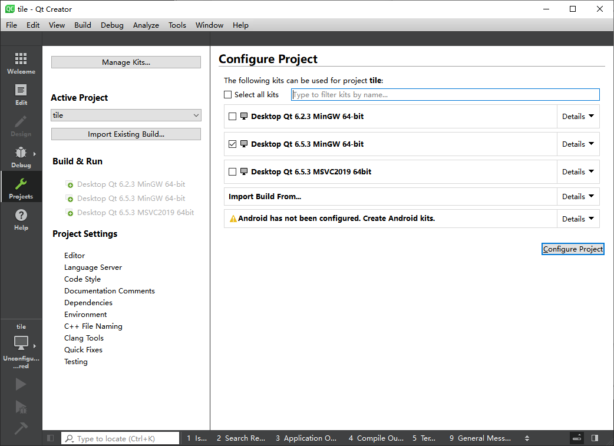

# Offline stroage tile map plugin for QtLocation
<p align="center">
English | <a href="README_zh_CN.md">简体中文</a>
</p>

Offline tile map plugin based on WebMercator projection, using datum WGS84.

+ Demo-OSM
<div align=center>
  
</div>

+ Support for **Windows**, **Linux**, **Android**, **MacOS** etc.
+ Support for **OSM**, **Google**, **Bing**, **Amap**, **Tianditu** and other offline tile maps.
+ Support map tilt, bearing etc.
+ Bulit with Qt6.5.3 or higher(only CMake supported).
+ Offline maps directly use GPS latitude and longitude coordinates without conversion.
+ Only one map type is available(The map id is fixed to 1), please use multiple plugin instances for multiple map layers, refer to example.

## Parameters
| Parameter | Description |
|-------|-------|
| tile.mapping.name | Custom map name |
| tile.mapping.minzoomlevel | The minimum zoom level for offline tiles, default 0 |
| tile.mapping.maxzoomlevel | The maximum scaling level of offline tiles is 19 by default and largest 25 level |
| tile.mapping.precachezoomlevel | Initializes the zoom level of loaded offline tiles to increase the speed at which maps are first displayed. The default is 0 |
| tile.mapping.cache.directory | Cache directory of offline tiles |
| tile.mapping.cache.hierarchy | Directory hierarchy of an offline tile. The default value is 0<br> 0: cache/{prefix}{z}-{x}-{y}.{image}<br>1: cache/{z}/{x}-{y}.{image}<br>2: cache/{z}/{x}/{y}.{image}<br>3: cache/{z}/{y}/{x}.{image} |
| tile.mapping.tile_prefix | This parameter is used when hierarchy is 0 and is compatible with the default cache tile file name that displays QtLocation. The prefix is before zxy. for example:<br>osm_100-l-4-2-3.png -> tile_prefix:osm_100-l-4 |

## Get started

+ Clone the repository.

```SHELL
git clone --recursive https://github.com/mml-0104/tile.git
```

+ Build

```
git clone --recursive https://github.com/mml-0104/tile.git
cd tile
mkdir build
cd build
cmake -DCMAKE_PREFIX_PATH=<YOUR_QT_SDK_DIR_PATH> -DCMAKE_BUILD_TYPE=Release -GNinja ../
cmake --build . --config Release --target all
```

or

Use your IDE (`Qt Creator` is recommended) to open the project and build. (only **CMake** supported).
<div align=center>
  
</div>

The **tile** plugin is now installed in the <YOUR_QT_SDK_DIR_PATH>/plugins/geoservices directory.


+ Run example

Decompress the test tile file in the example/cache directory to the current directory.

Modify the PluginParameter named **tile.mapping.cache.directory**  in the **osm.qml**  file using the decompression path described above.
```qml
//osm.qml
PluginParameter{
	name: "tile.mapping.cache.directory"
	value: "<YOUR_REPOSITORY_DIR>/tile/example/cache/osm"    
}
```

Modify the macro definition switch test tile set in main.cpp
```c++
//main.cpp
#if 1 //0: osm test  1:tianditu test
    engine.load(QUrl(QStringLiteral("qrc:/tianditu.qml")));
#else
    engine.load(QUrl(QStringLiteral("qrc:/osm.qml")));
#endif
```

+ Compile the project. Then try to execute the `example` demo program.

+ Great! Now you are ready to use **tile** plugin in your qt project, good lucky.
# Reference
[**qtlocation**: The srouce code for QtLocation](https://github.com/qt/qtlocation)

[**java_map_download**: Offline map downloader](https://gitcode.com/kurimuson/java_map_download/overview)

+ Donate
<div align=center>
  
</div>
<div align=center>
Buy the author a cup of coffee（Alipay）
</div>
